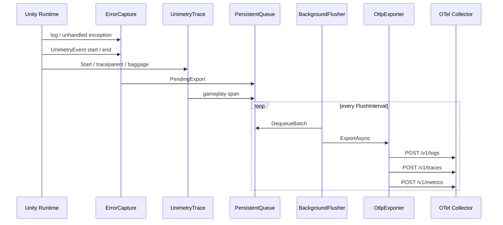

# Architecture

[English](ARCHITECTURE.md) | **日本語**

## レイヤー分離

Unimetry は次の 4 層に分かれています。

1. **Capture** — Unity / .NET イベントを `CapturedError` に正規化し、ゲームプレイ span、breadcrumb、ネイティブクラッシュの artifact を記録する
2. **Queue** — 送信失敗時の永続化と、プロセス再起動後の再送。キューファイルは保存時に暗号化する
3. **Mapping** — OTel Logs / Traces / Metrics JSON (OTLP/HTTP) への変換
4. **Export** — `UnityWebRequest` による HTTP POST

OpenTelemetry .NET SDK を使わない理由:

- Unity の IL2CPP / Mono 環境で SDK 全体が動作しない、またはサイズ・依存が大きい
- 必要なのは **Logs、限定的な Traces、少数の gauge** のみ
- OTLP/HTTP JSON は Collector が標準サポート

## データフロー



ネイティブクラッシュはこのループを通りません。Windows の未処理例外フィルタ、または macOS / iOS のシグナルハンドラが `persistentDataPath/unimetry/crashes/*.crash.json` を書きます。次回起動でそのファイルを読み、`unimetry.record_type=crash` の OTLP Log としてキューに入れます。

## なぜ Log と Trace の両方か

| Signal | 用途 |
| --- | --- |
| **Logs** | 例外本文、stacktrace 検索、Event、ログ基盤 (Loki 等) との統合 |
| **Traces** | error span とゲームプレイ span。`Activity.Current`、`UnimetryTrace`、W3C `traceparent` にトレースがあるときは、エラーはそのトレースに載る |
| **Metrics** | FPS、managed memory、起動時間の gauge |

周囲にトレースが無いエラーは、これまでどおり独立した `trace_id` を持ちます。`SetBaggage` で置いた baggage (`user.id`、`session.id` など) は span attribute にコピーします。resource には入れません。

## Collector 側の推奨 processor

```yaml
processors:
  batch:
    timeout: 5s
  attributes:
    actions:
      - key: unimetry.fingerprint
        action: insert
```

クラッシュログは Collector でファイルへコピーできます。minidump はプレイヤーのディスクに残り、OTLP には埋め込みません。シンボリケーションの鍵は `app.build_id` です。

```yaml
exporters:
  file/crash:
    path: /var/log/unimetry/logs.json
```

## 拡張ポイント

- `UnimetryOptions.Sanitizer` — 送信前 redaction
- `UnimetryOptions.ResourceAttributes` — `game.session_id` 等
- `UnimetryOptions.Headers` — API gateway 認証
- `UnimetryOptions.WithConsoleLog` / `WithLog` — エラーログと Event をユーザーのロガーへ複製
- `UnimetryEvent` — 開始と終了を持つ OTel Event。`[Event]` は Editor の IL Post Processor が織る
- `CaptureNativeCrashes` / `AddBreadcrumb` — Windows、macOS、iOS プレイヤーのネイティブクラッシュ。次回起動時に `unimetry.record_type=crash` として送信
- `UnimetryTrace` — ゲームプレイ span、W3C `traceparent`、baggage
- `CaptureMetrics` — FPS、managed memory、起動時間を `/v1/metrics` へ送る
- `UnimetrySettings` — Project Settings で編集する Resources アセット。`UNIMETRY_OTLP_ENDPOINT` が無いときに使う
