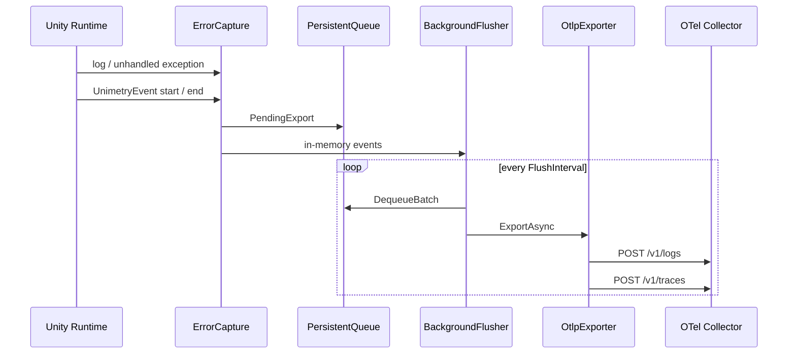

# Architecture

**English** | [日本語](ARCHITECTURE.ja.md)

## Layering

Unimetry is split into four layers.

1. **Capture** — normalize Unity / .NET events into `CapturedError`
2. **Queue** — persist failed sends and retry them after process restart
3. **Mapping** — convert to OTel Logs / Traces JSON (OTLP/HTTP)
4. **Export** — HTTP POST via `UnityWebRequest`

Reasons this package does not use the OpenTelemetry .NET SDK:

- The full SDK does not run reliably on Unity IL2CPP / Mono, or it is too large and pulls in too many dependencies
- The signals this library needs are **Logs plus a narrow slice of Traces**
- Collectors support OTLP/HTTP JSON out of the box

## Data flow



## Why both Logs and Traces

| Signal | Role |
| --- | --- |
| **Logs** | Exception body, stacktrace search, and integration with log backends (Loki and others) |
| **Traces** | Error spans in an APM view, and a parent/child relationship with future gameplay spans |

In v0.1 each error gets its own `trace_id`. Phase 3 extends this so an error can attach to an existing span.

## Recommended Collector processors

```yaml
processors:
  batch:
    timeout: 5s
  attributes:
    actions:
      - key: unimetry.fingerprint
        action: insert
```

For crashes (Phase 2):

```yaml
exporters:
  file/crash:
    path: ./crash-artifacts
```

## Extension points

- `UnimetryOptions.Sanitizer` — redact payloads before send
- `UnimetryOptions.ResourceAttributes` — extra resource attributes such as `game.session_id`
- `UnimetryOptions.Headers` — API gateway authentication
- `UnimetryOptions.WithConsoleLog` / `WithLog` — copy error logs and events to the user's logger
- `UnimetryEvent` — an OTel event with a start and an end. `[Event]` is woven by the Editor IL Post Processor
- `CaptureNativeCrashes` / `AddBreadcrumb` — Windows player native crashes, uploaded on the next launch as `unimetry.record_type=crash`
