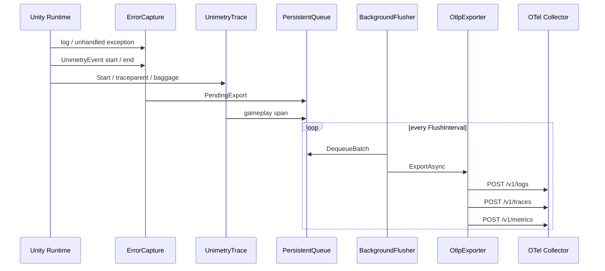

# Architecture

**English** | [日本語](ARCHITECTURE.ja.md)

## Layering

Unimetry is split into four layers.

1. **Capture** — normalize Unity / .NET events into `CapturedError`, and record gameplay spans, breadcrumbs, and native-crash artifacts
2. **Queue** — persist failed sends and retry them after process restart. The queue file is encrypted at rest
3. **Mapping** — convert to OTel Logs, Traces, and Metrics JSON (OTLP/HTTP)
4. **Export** — HTTP POST via `UnityWebRequest`

Reasons this package does not use the OpenTelemetry .NET SDK:

- The full SDK does not run reliably on Unity IL2CPP / Mono, or it is too large and pulls in too many dependencies
- The signals this library needs are **Logs, a narrow slice of Traces, and a few gauges**
- Collectors support OTLP/HTTP JSON out of the box

## Data flow



Native crashes do not go through this loop. A Windows unhandled-exception filter, or the macOS / iOS signal handler, writes `persistentDataPath/unimetry/crashes/*.crash.json`. The next launch reads that file and enqueues an OTLP log with `unimetry.record_type=crash`.

## Why both Logs and Traces

| Signal | Role |
| --- | --- |
| **Logs** | Exception body, stacktrace search, events, and integration with log backends (Loki and others) |
| **Traces** | Error spans and gameplay spans. An error uses the current trace when `Activity.Current`, `UnimetryTrace`, or a W3C `traceparent` has one |
| **Metrics** | Gauges for FPS, managed memory, and startup duration |

Each error still gets its own `trace_id` when no ambient trace is present. Baggage (`user.id`, `session.id`, and other keys set with `SetBaggage`) is copied onto span attributes. It is not added to the resource.

## Recommended Collector processors

```yaml
processors:
  batch:
    timeout: 5s
  attributes:
    actions:
      - key: unimetry.fingerprint
        action: insert
```

Crash logs can be copied to a file by the Collector. Minidumps stay on disk in the player and are not inlined into OTLP. `app.build_id` is the key for symbolication.

```yaml
exporters:
  file/crash:
    path: /var/log/unimetry/logs.json
```

## Extension points

- `UnimetryOptions.Sanitizer` — redact payloads before send
- `UnimetryOptions.ResourceAttributes` — extra resource attributes such as `game.session_id`
- `UnimetryOptions.Headers` — API gateway authentication
- `UnimetryOptions.WithConsoleLog` / `WithLog` — copy error logs and events to the user's logger
- `UnimetryEvent` — an OTel event with a start and an end. `[Event]` is woven by the Editor IL Post Processor
- `CaptureNativeCrashes` / `AddBreadcrumb` — native crashes on Windows, macOS, and iOS players, uploaded on the next launch as `unimetry.record_type=crash`
- `UnimetryTrace` — gameplay spans, W3C `traceparent`, and baggage
- `CaptureMetrics` — FPS, managed memory, and startup duration on `/v1/metrics`
- `UnimetrySettings` — Resources asset edited from Project Settings, used when `UNIMETRY_OTLP_ENDPOINT` is unset
