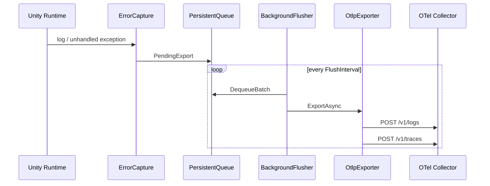

# Architecture

## レイヤー分離

Unimetry は次の 4 層に分かれています。

1. **Capture** — Unity / .NET イベントを `CapturedError` に正規化
2. **Queue** — 送信失敗時の永続化、プロセス再起動後の再送
3. **Mapping** — OTel Logs / Traces JSON (OTLP/HTTP) への変換
4. **Export** — `UnityWebRequest` による HTTP POST

OpenTelemetry .NET SDK を使わない理由:

- Unity の IL2CPP / Mono 環境で SDK 全体が動作しない、またはサイズ・依存が大きい
- 必要なのは **Logs + 限定的 Traces** のみ
- OTLP/HTTP JSON は Collector が標準サポート

## データフロー



## なぜ Log と Trace の両方か

| Signal | 用途 |
| --- | --- |
| **Logs** | 例外本文、stacktrace 検索、ログ基盤 (Loki 等) との統合 |
| **Traces** | APM ビューでの error span、将来の gameplay span との親子関係 |

v0.1 ではエラー 1 件につき独立した `trace_id` を生成します。Phase 3 で既存 span への attach に拡張します。

## Collector 側の推奨 processor

```yaml
processors:
  batch:
    timeout: 5s
  attributes:
    actions:
      - key: unimetry.fingerprint
        action: insert
```

クラッシュ (Phase 2) 用:

```yaml
exporters:
  file/crash:
    path: ./crash-artifacts
```

## 拡張ポイント

- `UnimetryOptions.Sanitizer` — 送信前 redaction
- `UnimetryOptions.ResourceAttributes` — `game.session_id` 等
- `UnimetryOptions.Headers` — API gateway 認証
